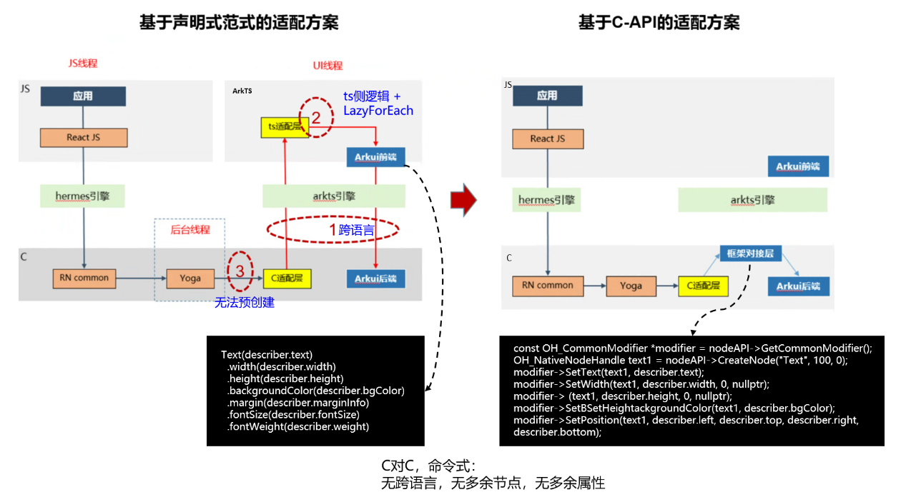
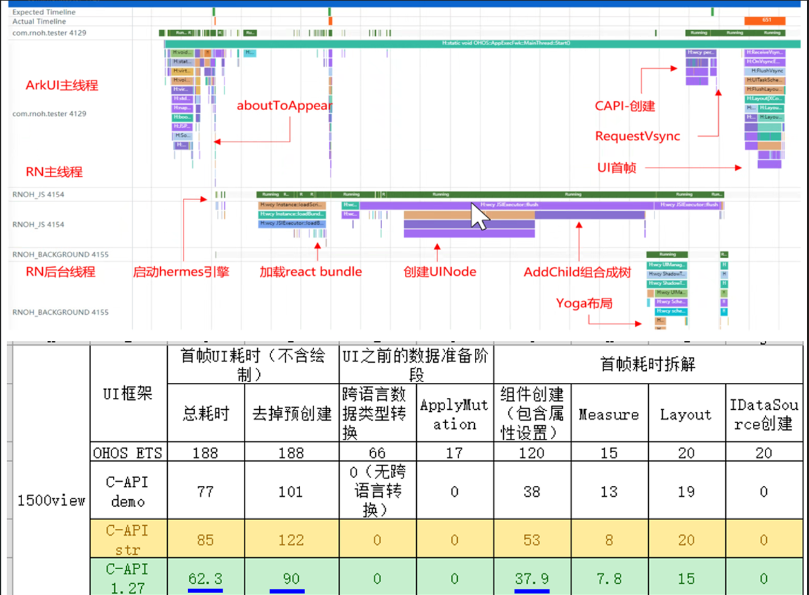
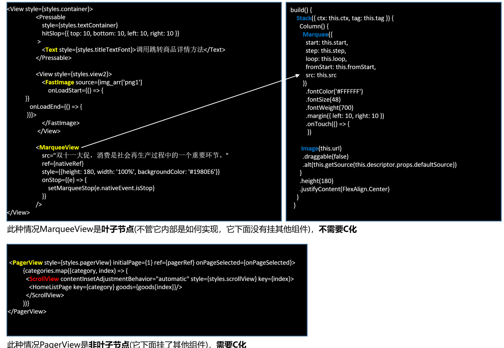

# C-API 架构

### 背景

为解决生态高性能的诉求，将 ArkUI 底层组件构建的命令式接口进行分层开放，开发者可以使用 C-API 和 ArkTS-API 分别进行开发，基于该背景**RN 框架**基于 C-API 做了底层适配，并且有着较好的性能提升。



**C-API 和 ArkTS 版本性能对比**



同时 RN 框架仍支持 C-API 混合模式，即在 RN C-API 环境中接入 ArkTS 侧的自定义 View（叶子型，不能是容器型），达到使用 ArkTS 高效开发组件和代码资产复用的目的。

**容器型和叶子型节点的判断：**



### 影响

因为 RN 中 C-API 架构有着更优秀的性能表现，因此三方库中所有的非叶子节点（容器型）库和需要更优秀性能的库都进行了 C-API 化适配，如 react-native-safe-area-context、react-native-linear-gradient 和 react-native-svg 等。

虽然在 RN 中 C-API 性能更优秀，但 ArkTS 有则更简洁开发方式、生态支持和解决方案，因此根据 `C-API/ArkTS` 和 `叶子节点/非叶子节点` 当前 RN 三方库中存在以下 4 类三方库：

- 基于 C-API 实现的叶子节点库
- 基于 C-API 实现的非叶子节点库
- 基于 ArkTS 实现的叶子节点库（混合方案）
- 基于 ArkTS 实现的非叶子节点库

由于 RN ArkTS 架构后续将不再做演进支持，所以**基于 ArkTS 实现的非叶子节点库**将不再维护更新并废弃。对于 RN 开发者使用高性能的 C-API 库，则需要确保在 HarmonyOS 工程开启 C-API 架构（默认开启），在 RN 工程中使用方式仍保持不变。

开启 C-API 架构：

```
// entry/src/main/ets/pages.ets
RNApp({
  rnInstanceConfig: {
    enableCAPIArchitecture: true, // 开启C-API架构
    ......
  }
```
