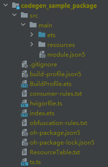
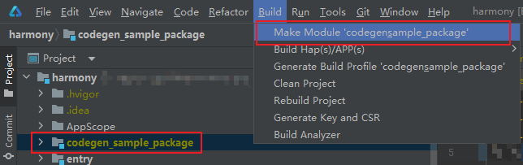
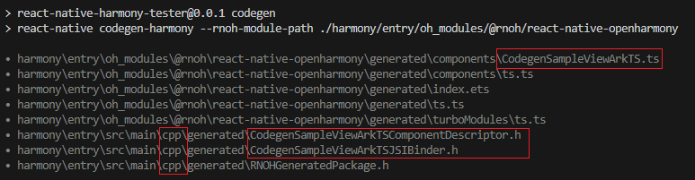
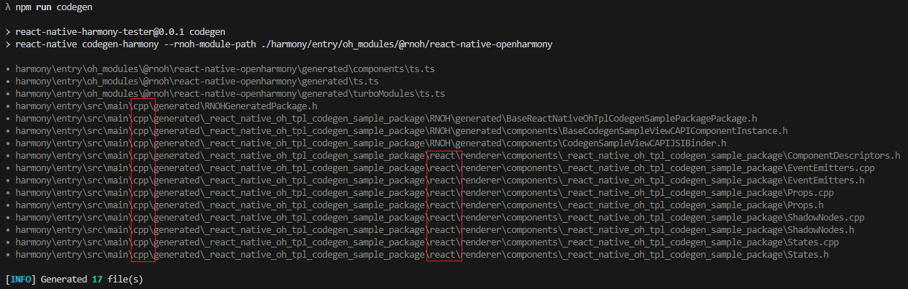

> 模板版本：v0.2.2

<p align="center">
  <h1 align="center"> <code>react-native-harmony-sample-package</code> </h1>
</p>

<p align="center">
    <a href="https://github.com/react-native-oh-library/react-native-harmony-sample-package">
        
    </a>
    <a href="https://github.com/react-native-oh-library/react-native-harmony-sample-package/blob/sig/License">
        
    </a>
</p>

> [!TIP] [Github 地址](https://github.com/react-native-oh-library/react-native-harmony-sample-package)

## 1. 安装与使用

### 1.1. 目录结构

本项目是 react-native-harmony 的示例工程，包含 Fabric、TurboModules 以及 Codegen 配置的不同示例，主要目录结构如下：

```yaml
├── codegen-sample-package # 适配 codegen 的示例组件
├── without-codegen-sample-package # 没用 codegen 的示例组件
├── tester # 用了上述组件的完整 RN 工程示例
│   ├── rnoh_package # react-native-harmony 相关依赖包
│   ├── harmony # rn harmony原生部分
│   │   └── react_native_openharmony
│   │       └── react_native_openharmony.har  # rnoh sdk包，需手动下载后放于该路径下
│   ├── index.js
│   ├── app.json
│   ├── package.json
│   ├── metro.config.js
│   └── tsconfig.json
├── package.json
└── License
```

### 1.2. 运行步骤

> tester 文件夹是一个可运行在 HarmonyOS 上的完整 RN 工程，另外还需下载一个 RNOH SDK，由于 SDK 体积较大，并未直接存于版本记录，请手动下载 [rnoh0.27.har](https://github.com/react-native-oh-library/react-native-harmony-sample-package/releases/tag/rnoh0.27.har) 并放于 `tester/harmony/react_native_openharmony` 目录下。

1. 克隆[该工程](https://github.com/react-native-oh-library/react-native-harmony-sample-package)到本地
2. 安装依赖：在 tester 目录下执行`npm install / yarn`
3. 生成 bundle 资源文件：在 tester 目录下执行`npm run dev`
4. 使用 DevEco Studio 打开 tester 目录下的 harmony 文件夹
5. 连接设备并在 IDE 中执行 Run

## 2. 约束与限制

本文档内容基于以下版本验证通过：

- RNOH: 0.72.27;
- SDK: HarmonyOS NEXT Developer Beta1 SDK
- IDE: DevEco Studio 5.0.3.402;
- ROM: 3.0.0.25(sp39);

## 3. 组件开发说明

### 3.1. codegen-sample-package

#### 3.1.1. Fabric 组件

开发 Fabric 组件时，原生部分可选择用 ArkTS 或 CAPI 两种类型，下面分别说明两种类型在开发时的步骤。

##### 3.1.1.1. ArkTS 类型

下面实现一个 ArkTS 类型的 Fabric 组件，这是组件最终的目录结构(只列出关键文件)：

```sh
codegen-sample-package
├── License
├── harmony
│   ├── codegen_sample_package # native 源码
│   │   ├── index.ets # 入口 用于导出
│   │   ├── ts.ts # 用于导出
│   │   ├── oh-package.json5
│   │   └── src
│   │       └── main
│   │           ├── ets
│   │           │   ├── CodegenSamplePackage.ts # 导出 native 模块
│   │           │   └── CodegenSampleView.ets # 具体 native 实现
│   │           └── resources
│   └── codegen_sample_package.har # native 源码har包
├── index.ts # 入口文件
├── package.json
└── src
    └── Fabric
        ├── IndexArkTS.tsx # Fabric入口
        └── specs
            └── v1
                └── CodegenArkTSNativeComponent.ts # JavaScript 接口声明
```

以下是组件的开发步骤

1. **RN 侧**: 初始化 RN 工程目录
2. **RN 侧**: 添加 JavaScript 接口声明文件 [`src/Fabric/specs/v1/CodegenArkTSNativeComponent.ts`](https://github.com/react-native-oh-library/react-native-harmony-sample-package/blob/sig/codegen-sample-package/src/Fabric/specs/v1/CodegenArkTSNativeComponent.ts)  
   对于声明类型的代码文件必须满足以下两点要求：

   - 文件必须使用 `<MODULE_NAME>NativeComponent` 命名
   - 代码中必须要输出 `HostComponent` 对象。

3. **RN 侧**: 根据业务编写 Fabric 入口文件 [`IndexArkTS.tsx`](https://github.com/react-native-oh-library/react-native-harmony-sample-package/blob/sig/codegen-sample-package/src/Fabric/IndexArkTS.tsx)
4. **RN 侧**: 添加 codegen 配置
   codegen 配置项位于 package.json 文件中的 harmony 字段下:

   ```json
   {
     "name": "@react-native-oh-tpl/codegen-sample-package",
     "harmony": {
       "alias": "codegen-sample-package", // 组件别名
       "codegenConfig": [
         {
           "version": 1, // version 取值范围： 1 | 2, 其中 1 表示 ArkTS 形式
           "specPaths": ["./src/Fabric/specs/v1"] // 需要codegen的路径
         }
       ]
     }
   }
   ```

   - `version` 表示 codegen 的版本，取值为 1 | 2, 1 表示 ArkTS 形式，2 表示 CAPI 形式
   - `specPaths` 填写需要 codegen 的路径，也就是 JavaScript 接口声明文件

5. **native 侧**: 工程根目录添加 `harmony` 文件夹
   > 该目录暂时先留空，下面先通过 DevEco Studio 编写好 native 代码后再拷贝进来
6. **native 侧**: 使用 DevEco Studio 初始化组件模板：`New => Module => Static Library`，输入模块名 `codegen_sample_package` 可得到如下结构工程:  
   
7. **native 侧**: 在 ets 文件夹中，添加 [`CodegenSampleView.ets`](https://github.com/react-native-oh-library/react-native-harmony-sample-package/blob/sig/codegen-sample-package/harmony/codegen_sample_package/src/main/ets/CodegenSampleView.ets) 文件，该文件是具体的 native 实现，包含生命周期方法和组件的界面渲染方法
8. **native 侧**: 在 ets 文件夹中，添加 [`CodegenSamplePackage.ts`](https://github.com/react-native-oh-library/react-native-harmony-sample-package/blob/sig/codegen-sample-package/harmony/codegen_sample_package/src/main/ets/CodegenSamplePackage.ts) 文件，该文件通过 `createDescriptorWrapperFactoryByDescriptorType` 定义了 native 侧导出的组件名
9. **native 侧**: 编写入口文件 [`index.ets`](https://github.com/react-native-oh-library/react-native-harmony-sample-package/blob/sig/codegen-sample-package/harmony/codegen_sample_package/index.ets) 和 [`ts.ts`](https://github.com/react-native-oh-library/react-native-harmony-sample-package/blob/sig/codegen-sample-package/harmony/codegen_sample_package/ts.ts)
10. **native 侧**: `oh-package.json5` 文件中添加 @rnoh/react-native-openharmony 依赖
    ```json
    // oh-package.json5
    {
      "dependencies": {
        "@rnoh/react-native-openharmony": "file:../react_native_openharmony"
      }
    }
    ```
11. **native 侧**: 将 native 源码打成 har 包。
    1. 选中左侧中本组件目录
    2. 点击 `Build -> Make Module xxx` 将 native 源码打成 har 包
       
    3. 在 `codegen_sample_package/build/default/outputs/default` 路径下找到`codegen_sample_package.har`
12. **native 侧**: 将 har 包以及源码复制到 RN 工程根目录下的 harmony 文件夹中
13. **RN 侧**: 执行 `npm pack` 命令打出 tgz 包

##### 3.1.1.2. CAPI 类型

下面实现一个 CAPI 类型的 Fabric 组件，这是组件最终的目录结构(只列出关键文件)：

```sh
codegen-sample-package
├── License
├── harmony
│   ├── codegen_sample_package # native 源码
│   │   ├── oh-package.json5
│   │   └── src
│   │       └── main
│   │           ├── cpp
│   │           │   ├── CMakeLists.txt
│   │           │   ├── CodegenSamplePackage.cpp
│   │           │   ├── CodegenSamplePackage.h
│   │           │   └── CodegenSampleViewComponentInstance.h
│   │           └── resources
│   └── codegen_sample_package.har # native 源码har包
├── index.ts # 入口文件
├── package.json
└── src
    └── Fabric
        ├── IndexCAPI.tsx # Fabric入口
        └── specs
            └── v2
                └── CodegenCApiNativeComponent.ts # JavaScript 接口声明
```

CAPI 类型的 Fabric 组件整体开发流程和 ArkTS 一致，以下是组件的开发步骤：

1. **RN 侧**: 初始化 RN 工程目录
2. **RN 侧**: 添加 JavaScript 接口声明文件 [`src/Fabric/specs/v2/CodegenCApiNativeComponent.ts`](https://github.com/react-native-oh-library/react-native-harmony-sample-package/blob/sig/codegen-sample-package/src/Fabric/specs/v2/CodegenCApiNativeComponent.ts)
3. **RN 侧**: 根据业务编写 CAPI 入口文件 [`IndexCAPI.tsx`](https://github.com/react-native-oh-library/react-native-harmony-sample-package/blob/sig/codegen-sample-package/src/Fabric/IndexCAPI.tsx)
4. **RN 侧**: 添加 codegen 配置

   ```json
   {
     "name": "@react-native-oh-tpl/codegen-sample-package",
     "harmony": {
       "alias": "codegen-sample-package",
       "codegenConfig": [
         {
           "version": 2,
           "specPaths": ["./src/Fabric/specs/v2"]
         }
       ]
     }
   }
   ```

5. **native 侧**: 工程根目录添加 `harmony` 文件夹
6. **native 侧**: 使用 DevEco Studio 初始化组件模板（同上）
7. **native 侧**: 在 `src/main`中添加 `cpp` 文件夹中
   1. 添加 [`CMakeLists.txt`](https://github.com/react-native-oh-library/react-native-harmony-sample-package/blob/sig/codegen-sample-package/harmony/codegen_sample_package/src/main/cpp/CMakeLists.txt) 文件
   2. 添加 [`CodegenSamplePackage.cpp`](https://github.com/react-native-oh-library/react-native-harmony-sample-package/blob/sig/codegen-sample-package/harmony/codegen_sample_package/src/main/cpp/CodegenSamplePackage.cpp) 文件
   3. 添加 [`CodegenSamplePackage.h`](https://github.com/react-native-oh-library/react-native-harmony-sample-package/blob/sig/codegen-sample-package/harmony/codegen_sample_package/src/main/cpp/CodegenSamplePackage.h) 文件
   4. 添加 [`CodegenSampleViewComponentInstance.h`](https://github.com/react-native-oh-library/react-native-harmony-sample-package/blob/sig/codegen-sample-package/harmony/codegen_sample_package/src/main/cpp/CodegenSampleViewComponentInstance.h) 文件
8. **native 侧**: `oh-package.json5` 文件中添加 @rnoh/react-native-openharmony 依赖（同上）
9. **native 侧**: 将 native 源码打成 har 包（同上）
10. **native 侧**: 将 har 包以及源码复制到 RN 工程根目录下的 harmony 文件夹中（同上）
11. **RN 侧**: 执行 `npm pack` 命令打出 tgz 包（同上）

### 3.2. no-codegen-sample-package

由于目前 codegen 命令需要在 RN 侧执行，在一些流水线或 RN 和原生分离的场景下，不便于执行 codegen 命令。于是对于这类场景衍生了一种 no-codegen 的解决方案。主要是在组件开发阶段就将 codegen 产物生成好，提前放置于包内，无需在运行时执行 codegen。

因此 no-codegen 的开发前提是先开发好 codegen 形式的组件(参考 3.1 章节)，然后把产物移到组件包内。

#### 3.2.1. Fabric 组件

##### 3.2.1.1. ArkTS 类型

> 前提：已经参考[codegen-sample-package](#31-codegen-sample-package)完成 codegen 形式的 ArkTS 组件

实现一个 no-codegen ArkTS 类型的 Fabric 组件，RN 侧目录结构无改动，下面列出 native 侧的目录结构(只列出关键文件)：

```sh
harmony
└── codegen_sample_package # native 源码
    ├── index.ets
    ├── ts.ts
    ├── oh-package.json5
    └── src
        └── main
            ├── cpp # codegen 生成的 C++ 文件
            │   ├── CMakeLists.txt
            │   ├── CodegenArkTSSamplePackage.cpp
            │   ├── CodegenArkTSSamplePackage.h
            │   ├── CodegenSampleViewArkTSJSIBinder.h
            │   └── CodegenSampleViewArkTSComponentDescriptor.h
            ├── ets
            │   ├── namespace # codegen 生成于sdk内的产物
            │   │   ├── index.ts
            │   │   └── sampleView.ts
            │   ├── CodegenSamplePackage.ts # 导出 native 模块
            │   └── CodegenSampleView.ets # 具体 native 实现
            └── resources
```

以下是将 codegen 组件转为 no-codegen 的步骤：

1. 找一个 RN 工程，引入已开发完成的 codegen-sample-package 三方库

   ```json
   {
     "name": "react-native-harmony-tester",
     "scripts": {
       "start": "npm run codegen && hdc rport tcp:8081 tcp:8081 && react-native start",
       "codegen": "react-native codegen-harmony --rnoh-module-path ./harmony/entry/oh_modules/@rnoh/react-native-openharmony"
     },
     "dependencies": {
       "@react-native-oh-tpl/codegen-sample-package": "file:../codegen-sample-package/react-native-oh-tpl-codegen-sample-package-0.0.1.tgz"
     }
   }
   ```

2. **RN 侧**: 在 script 中，添加 [codegen](https://gitee.com/react-native-oh-library/usage-docs/blob/master/zh-cn/codegen.md) 命令 `react-native codegen-harmony --rnoh-module-path ./harmony/entry/oh_modules/@rnoh/react-native-openharmony`
3. **RN 侧**: 执行 codegen 命令，查看生成的产物文件
   
4. **native 侧**: 移入 codegen 命令生成的 c++ 文件

   1. 在 `src/main` 中添加 `cpp` 文件夹，放入 codegen 命令生成该组件的 c++ 文件： `xxxComponentDescriptor.h` 与 `xxxJSIBinder.h`
   2. 在 `src/main/cpp` 中添加 [`xxxPackage.h`](https://github.com/react-native-oh-library/react-native-harmony-sample-package/blob/sig/no-codegen-sample-package/harmony/no_codegen_sample_package/src/main/cpp/forArkTS/NoCodegenArkTSSamplePackage.h) 文件，文件内容参考 codegen 命令生成的 `RNOHGeneratedPackage.h` 文件
   3. 在 `src/main/cpp` 中添加 [`xxxPackage.cpp`](https://github.com/react-native-oh-library/react-native-harmony-sample-package/blob/sig/no-codegen-sample-package/harmony/no_codegen_sample_package/src/main/cpp/forArkTS/NoCodegenArkTSSamplePackage.cpp) 文件
   4. 在 `src/main/cpp` 中添加 [`CMakeLists.txt`](https://github.com/react-native-oh-library/react-native-harmony-sample-package/blob/sig/no-codegen-sample-package/harmony/no_codegen_sample_package/src/main/cpp/forArkTS/CMakeLists.txt) 文件

      > codegen 命令生成的 `RNOHGeneratedPackage.h` 文件是所有 codegen 组件的公共文件，请勿直接放入 cpp 文件夹中。建议在 codegen => no-codegen 时，只保留当前组件以减少 `RNOHGeneratedPackage.h` 中其他组件的的干扰

5. **native 侧**: 移入 codegen 命令生成的 ts 文件
   1. 在 `src/main/ets` 中添加 `namespace` 文件夹，放入 codegen 命令生成该组件的 ts 文件，如示例图中的 [`CodegenSampleViewArkTS.ts`](https://github.com/react-native-oh-library/react-native-harmony-sample-package/blob/sig/no-codegen-sample-package/harmony/no_codegen_sample_package/src/main/ets/namespace/sampleView.ts)
   2. 在 `src/main/cpp` 中添加导出文件 [`index.ts`](https://github.com/react-native-oh-library/react-native-harmony-sample-package/blob/sig/no-codegen-sample-package/harmony/no_codegen_sample_package/src/main/ets/namespace/index.ts)
6. **native 侧**: 修改文件路径的引用，将之前从 `@rnoh/react-native-openharmony/generated` 引用的路径改为从 `namespace` 中引入
7. **RN 侧**: 将原有 package.json 中 codegen 配置删除
   ```diff
   {
     "name": "@react-native-oh-tpl/codegen-sample-package",
     "harmony": {
       "alias": "codegen-sample-package",
   -     "codegenConfig": [
   -       {
   -         "version": 1,
   -         "specPaths": ["./src/Fabric/specs/v1"]
   -       }
   -     ]
     }
   }
   ```

以上就是将 ArkTS 类型的 Fabric 组件转为 no-codegen 所需的修改步骤。

##### 3.1.1.2. CAPI 类型

> 前提：已经参考[codegen-sample-package](#31-codegen-sample-package)完成 codegen 形式的 CAPI 组件

实现一个 no-codegen CAPI 类型的 Fabric 组件，RN 侧目录结构无改动，下面列出 native 侧的目录结构(只列出关键文件)：

```sh
harmony
└── codegen_sample_package # native 源码
    ├── oh-package.json5
    └── src
        └── main
            ├── cpp # codegen 生成的 C++ 文件
            │   ├── react/renderer/components/xxx
            │   │   ├── ComponentDescriptors.h
            │   │   ├── EventEmitters.cpp
            │   │   ├── EventEmitters.h
            │   │   ├── Props.cpp
            │   │   ├── Props.h
            │   │   ├── ShadowNodes.cpp
            │   │   ├── ShadowNodes.h
            │   │   ├── States.cpp
            │   │   └── States.h
            │   ├── BaseCodegenSampleViewCAPIComponentInstance.h
            │   ├── BaseReactNativeOhTplCodegenSamplePackagePackage.h
            │   ├── CMakeLists.txt
            │   ├── CodegenCAPISamplePackage.cpp
            │   ├── CodegenCAPISamplePackage.h
            │   ├── CodegenSampleViewCAPIJSIBinder.h
            │   └── CodegenSampleViewComponentInstance.h
            └── resources
```

以下是将 codegen 组件转为 no-codegen 的步骤：

1. 找一个 RN 工程，引入已开发完成的 codegen-sample-package 三方库

   ```json
   {
     "name": "react-native-harmony-tester",
     "scripts": {
       "start": "npm run codegen && hdc rport tcp:8081 tcp:8081 && react-native start",
       "codegen": "react-native codegen-harmony --rnoh-module-path ./harmony/entry/oh_modules/@rnoh/react-native-openharmony"
     },
     "dependencies": {
       "@react-native-oh-tpl/codegen-sample-package": "file:../codegen-sample-package/react-native-oh-tpl-codegen-sample-package-0.0.1.tgz"
     }
   }
   ```

2. **RN 侧**: 在 script 中，添加 [codegen](https://gitee.com/react-native-oh-library/usage-docs/blob/master/zh-cn/codegen.md) 命令 `react-native codegen-harmony --rnoh-module-path ./harmony/entry/oh_modules/@rnoh/react-native-openharmony`
3. **RN 侧**: 执行 codegen 命令，查看生成的产物文件
   
4. **native 侧**: 移入 codegen 命令生成的 c++ 文件

   1. 打开 `src/main/cpp`，移入 codegen 命令生成该组件的 react 下的 c++ 文件夹： `react/renderer/components/xxx`
   2. 修改 `src/main/cpp/react` 中的文件引用路径，如 `#include <react/renderer/components/_react_native_oh_tpl_codegen_sample_package/ShadowNodes.h>` => `#include "ShadowNodes.h"`
   3. 打开 `src/main/cpp`，移入 codegen 命令生成该组件的 RNOH 下的 c++ 文件： `BaseXXXComponentInstance.h`、`xxxJSIBinder.h`、`BasexxxPackage.h`
      > `src/main/cpp` 已有的文件：`CMakeLists.txt`、`xxxPackage.cpp`、`xxxPackage.h`、`XXXComponentInstance.h`
   4. 修改 `src/main/cpp` 已有的文件的路径引用，如 `#include "RNOH/generated/BasexxxPackage.h"` => `#include "BasexxxPackage.h"`
   5. 修改 [`CMakeLists.txt`](https://github.com/react-native-oh-library/react-native-harmony-sample-package/blob/sig/no-codegen-sample-package/harmony/no_codegen_sample_package/src/main/cpp/forCAPI/CMakeLists.txt)
5. **RN 侧**: 将原有 package.json 中 codegen 配置删除
   ```diff
   {
     "name": "@react-native-oh-tpl/codegen-sample-package",
     "harmony": {
       "alias": "codegen-sample-package",
   -     "codegenConfig": [
   -       {
   -         "version": 2,
   -         "specPaths": ["./src/Fabric/specs/v2"]
   -       }
   -     ]
     }
   }
   ```

## 4. 开源协议

本项目基于 [The MIT License (MIT)](https://github.com/react-native-oh-library/react-native-harmony-sample-package/blob/sig/License) ，请自由地享受和参与开源。
